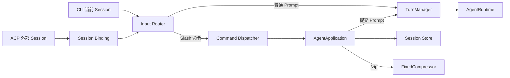

# Mini Agent Roadmap

## v0.1.0：最小可运行闭环

`v0.1.0` 是第一个可运行基线，目标是证明各模块能够通过统一应用层组成完整 Agent，而不是提供生产级可靠性。

已经具备：

- 固定 DashScope API 地址与固定模型，使用 SSE 流式传输。
- 单 Agent Tool Loop，以及文件读取、检索、写入、补丁和可选 PowerShell Tool。
- `standard`、`trusted`、`locked` 三种应用层权限模式。
- SQLite Session 创建、恢复、归档、删除和压缩检查点。
- System Rules、Skills、Hooks、MCP Tools 和 ACP 文本协议。
- Windows 优先的 CLI，以及 `weixin-acp` 启动脚本。

已知边界：

- 没有操作系统级沙箱；PowerShell 以当前 Windows 用户权限运行。
- 模型请求没有瞬时错误重试和退避。
- 同一 Session 的并发 Turn 没有统一协调。
- 运行中断和进程崩溃没有完整的 Turn 恢复状态。
- ACP 只支持文本，不支持图片、语音、文件和 Embedded Context。
- MCP 当前只接入 stdio Tools，不包含 HTTP、Resources 和 Prompts。

## v0.2.0：可靠 Turn 与会话控制

> 实现状态：已完成。下列范围已在 `v0.2.0` 分支落地并通过自动化测试；“验收条件”同时作为发布前回归清单。

`v0.2.0` 只建设三条主线：可靠 Turn、可控压缩、CLI/ACP 共用会话命令。该版本加固已经跑通的单 Agent 闭环，不扩展多模型、多 Agent、工作区切换或 ACP 多媒体能力。

### 1. 统一术语与状态

运行层统一使用以下层级，避免 Run 与 Turn 混用：

```text
Session -> Turn -> Model Attempt -> Tool Call
```

- `Session`：持久化会话，绑定一个固定工作区。
- `Turn`：从一个用户 Prompt 开始，到最终响应、失败或取消结束。
- `Model Attempt`：一次模型 API 请求；自动重试会产生新的 Attempt，但不产生新的 Turn。
- `Tool Call`：模型在某个 Attempt 中请求执行的工具操作。

Turn 状态：

```text
queued -> running -> waiting_tool -> completed
                   |-> failed
                   |-> cancelled
                   `-> interrupted
```

同一 Session 的 Turn 使用 FIFO 串行执行，不同 Session 可以并发。Agent 重启时，遗留的 `running` 或 `waiting_tool` Turn 统一标记为 `interrupted`，保留上下文但绝不自动重新执行 Tool。

### 2. Turns 模块

新增 `turns/`，集中管理运行生命周期，CLI 和 ACP 不再各自保存活动任务：

```text
turns/
  models.py        # Turn、状态、错误类别和时间信息
  manager.py       # 每 Session 队列、活动 Turn 和状态转换
  cancellation.py  # 统一取消信号与清理回调
```

`TurnManager` 负责：

- 为每个 Prompt 分配 `turn_id`。
- 保证同一 Session 的消息和事件不会交错写入。
- 把取消传播给模型流、PowerShell Tool 和 MCP Tool。
- 在 Turn 结束时统一写入完成、失败、取消或中断状态。
- 对外提供按 Session 取消当前 Turn 的接口。

### 3. Session 与数据库迁移

SQLite 增加 schema version、Turn 持久化和协议会话绑定：

```text
turns
  id, session_id, state, prompt_event_seq,
  started_at, finished_at, error_kind, error_message

session_bindings
  channel, external_session_id, internal_session_id,
  created_at, updated_at
```

迁移要求：

- 使用 `PRAGMA user_version` 管理有序迁移。
- `v0.1.0` 数据库首次升级前创建备份。
- 迁移失败时保留原数据库并拒绝继续启动。
- Session 增加可选名称；名称在同一工作区内不区分大小写且唯一。
- Session 的工作区创建后不可修改。

### 4. 共享命令层

新增共享命令解析与分发层，CLI 和 ACP 调用同一套应用服务。命令文本不会作为普通用户 Prompt 发送给模型或写入消息历史，只记录控制事件；`/zip` 仍会通过固定压缩器调用模型生成 Checkpoint。



```text
/new [name]
/list
/resume <session-id|name>
/zip
```

命令语义：

- `/new [name]`：在当前工作区创建并切换到新 Session；原 Session 保持原状态；新 Session 不继承旧 Session 的会话规则和已激活 Skills。
- `/list`：列出当前工作区的 Session，显示当前标记、名称、短 ID、状态和更新时间。
- `/resume <session-id|name>`：使用完整 ID、唯一 ID 前缀或精确名称恢复并切换；歧义匹配必须拒绝并显示候选项；已归档 Session 自动恢复为 active。
- `/zip`：主动压缩当前 Session，只在完整 Turn 边界创建 Checkpoint，保留最近一个完整 Turn；没有可压缩内容时返回 no-op。

`/resume` 不支持跨工作区。`v0.2.0` 不增加修改工作区的命令。

ACP 出现并发输入时，`/new`、`/resume` 和 `/zip` 与当前 Session 的 Turn 串行，按接收顺序等待当前 Turn 结束；只读的 `/list` 可以直接执行。取消命令不经过该队列，由 ACP `session/cancel` 进入 `TurnManager`。

### 5. ACP 对新增命令的支持

本版本的 ACP 目标仅限于支持上述四个新增命令，不扩展为完整 ACP 功能开发。

- ACP 在 Session 创建、加载或恢复后发送 `available_commands_update`，声明 `/new`、`/list`、`/resume` 和 `/zip`。
- ACP Prompt 收到完整 Slash 命令时先交给共享命令层，普通 Prompt 才进入模型 Turn。
- `session_bindings` 持久化 `ACP 外部 Session ID -> Mini Agent 当前内部 Session ID`。
- `/new` 和 `/resume` 更新绑定；后续 ACP Prompt 仍使用原外部 ID，但路由到切换后的内部 Session。
- `/list` 只列出绑定工作区的 Session；`/zip` 作用于当前绑定的内部 Session。
- ACP 取消请求通过绑定找到内部 Session，再交给 `TurnManager`。
- 命令结果通过普通 ACP Agent 文本更新返回，不伪造模型响应和 token usage。

`weixin-acp@0.6.0` 会自行处理 `/echo`、`/toggle-debug` 和 `/clear`，未识别的 Slash 命令会继续传给 ACP Agent，因此上述四个命令不需要修改微信桥接包。

持久化 Binding 只能在 ACP Client 继续使用同一个外部 Session ID 并调用 load/resume 时自动恢复。`weixin-acp` 自身重启后会创建新的外部 ACP Session，Mini Agent 无法从 ACP 参数反推出原微信会话；此时用户通过 `/list` 和 `/resume` 恢复目标内部 Session。

### 6. Model API 重试边界

在 `model_api/` 内增加固定重试策略：

- 连接失败、429、502、503 和 504 最多执行三次 Attempt。
- 使用带抖动的指数退避并尊重 `Retry-After`。
- 只有在尚未产生 Text、Reasoning 或 Tool Call 时允许自动重试。
- 一旦产生可见输出或 Tool Call，后续断流直接结束为失败或中断，禁止自动重放。
- 记录 Attempt 次数、服务端请求 ID 和错误类别，不记录 API Key。

### 7. 主动压缩与失败降级

`/zip` 与自动压缩共用同一个固定压缩器和 Checkpoint 写入路径：

- 切点不能位于 assistant Tool Call 与对应 Tool Result 之间。
- 压缩输入必须设置上限；超限时分段汇总，再生成最终 Checkpoint。
- 已有 Checkpoint 时只合并新增的完整 Turn。
- 压缩失败时不推进 Checkpoint、不删除历史，并返回可诊断错误。
- 保存触发方式 `automatic|manual`、覆盖事件区间、压缩版本和 token 估算。
- 从上次 Checkpoint 后没有新的完整 Turn 时，`/zip` 不调用模型。

### 8. Tool 与 MCP 的最小可靠性加固

- `write_file` 和 `apply_patch` 使用同目录临时文件加原子替换，避免留下半文件。
- 写入支持可选预期哈希，发现并发修改时拒绝覆盖。
- PowerShell 取消必须终止整个进程树。
- MCP Tool 取消尽力传播给 Server；无法确认取消时把 Turn 标记为 interrupted。
- 单个 MCP Server 启动失败只禁用该 Server 并记录错误，不阻止其他 Server 和 Agent 启动。

本版本不实现 Artifact 模块、MCP 自动重连或 MCP 新传输。

### 9. 开发顺序

```text
数据库迁移与 Session 名称
  -> Turns 模块与并发测试
  -> 取消和崩溃恢复
  -> Model API 重试
  -> 共享命令层与 CLI
  -> ACP Session Binding 与命令支持
  -> /zip 和压缩失败降级
  -> 原子 Tool 与 MCP 启动隔离
  -> 全链路回归和版本升级
```

每个阶段独立提交并保持测试通过，不在同一提交中同时重构 Session、ACP 和压缩。

### 10. v0.2.0 验收条件

- CLI 和 ACP 均支持 `/new`、`/list`、`/resume`、`/zip`，且输出语义一致。
- ACP 能发布可用命令；微信发送上述命令时不会进入模型。
- ACP 通过 `/new` 或 `/resume` 切换后，后续消息进入正确的内部 Session；使用相同外部 Session ID load/resume 时，Agent 重启后绑定仍可恢复。
- 同一 Session 同时提交两个 Prompt 时按 FIFO 执行，消息和 Tool Result 不交错。
- 不同 Session 可以并发运行。
- 模型在首次输出前返回可重试错误时按策略恢复；产生 Tool Call 后断流不会重复执行 Tool。
- PowerShell 执行期间可以取消，取消后没有遗留子进程。
- 强制终止 Agent 后，未完成 Turn 在下次启动时变为 interrupted，Tool 不自动重放。
- `/zip` 只在合法边界创建 Checkpoint；失败和 no-op 都不破坏历史。
- `v0.1.0` 数据库可以自动备份、迁移并恢复 Session。
- 一个 MCP Server 启动失败不会影响其他 Server、CLI 或 ACP 启动。

## v0.2.0 明确不包含

- 工作区切换、多工作区 Runtime 或 Additional Directories。
- ACP 图片、语音、文件、Fork、动态 MCP Server 或其他新能力。
- MCP HTTP、SSE、Resources、Prompts、自动重连和健康检查。
- Skills YAML 解析重构、Skill Resource Tool 或自动 Skill 选择。
- 新增 Hook 类型或 Hook 参数重写管线改造。
- Artifact、长期记忆、向量数据库和后台定时任务。
- 操作系统级沙箱、Windows 容器隔离。
- 多 Provider、多 Model 路由和多 Agent 编排。
